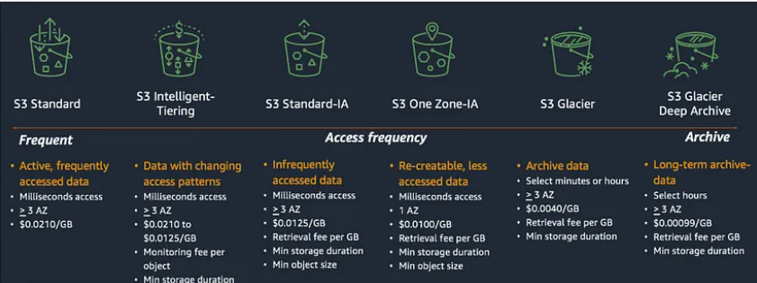

# Amazon S3

### What is Amazon S3?
Amazon S3 (Simple Storage Service) is a scalable and secure cloud storage service provided by Amazon Web Services (AWS). It allows you to store and retrieve any amount of data from anywhere on the web.

### What are S3 buckets?
S3 buckets are containers for storing objects (files) in Amazon S3. Each bucket has a unique name globally across all of AWS. Think of an S3 bucket as a top-level folder that holds your data.

### Why use S3 buckets?
S3 buckets provide a reliable and highly scalable storage solution for various use cases, such as:
- Backup and restore
- Data archiving
- Content storage for websites
- Data source for big data analytics

### Key benefits of S3 buckets:
- **Durability and availability:** High durability and availability for your data.
- **Scalability:** Store and retrieve any amount of data without capacity constraints.
- **Security:** Features like encryption, access control, and audit logging.
- **Performance:** High performance for data operations.
- **Cost-effective:** Flexible pricing models based on usage patterns.

## Creating and Configuring S3 Buckets

### Creating an S3 bucket

To create an S3 bucket, you can use the AWS Management Console, AWS CLI (Command Line Interface), or AWS SDKs (Software Development Kits). You need to specify a globally unique bucket name and select the region where you want to create the bucket.

### Choosing a bucket name and region

The bucket name must be unique across all existing bucket names in Amazon S3. It should follow DNS naming conventions, be 3-63 characters long, and contain only lowercase letters, numbers, periods, and hyphens. The region selection affects data latency and compliance with specific regulations.

Bucket properties and configurations

Versioning: Versioning allows you to keep multiple versions of an object in the bucket. It helps protect against accidental deletions or overwrites.

### Choosing a bucket name and region
- **Bucket Name:** Must be unique across all of AWS, follow DNS naming conventions, and be 3-63 characters long.
- **Region:** Affects data latency and regulatory compliance.

### Bucket properties and configurations
- **Versioning:** Keep multiple versions of an object in the bucket to protect against accidental deletions or overwrites.

### Bucket-level permissions and policies
Define who can access the bucket and perform actions using IAM (Identity and Access Management) policies for fine-grained access control.

## Uploading and Managing Objects in S3 Buckets

### Uploading objects
Use the AWS Management Console, AWS CLI, SDKs, or direct HTTP uploads. Each object is assigned a unique key (name) within the bucket for retrieval.

### Object metadata and properties
Metadata includes attributes like content type, cache control, encryption settings, and custom metadata to manage and organize objects.

### File formats and object encryption
- Supports various file formats (e.g., text, images, videos).
- Encrypt objects using server-side encryption options: SSE-S3, SSE-KMS, and SSE-C.

### Lifecycle management
Define rules to transition objects between storage classes or delete them based on predefined criteria (e.g., move to lower-cost storage after a certain time).

### Multipart uploads
Upload large objects in parts for improved performance and resiliency. Multipart uploads support parallel uploads and resumable transfers.

### Managing large datasets with S3 Batch Operations
Perform bulk operations (e.g., copying, tagging, deleting) on large datasets efficiently.

## Advanced S3 Bucket Features

### S3 Storage Classes
Multiple storage classes for different use cases and performance requirements:
- **Standard:** General-purpose.
- **Intelligent-Tiering:** Cost-optimization based on access patterns.
- **One Zone-IA:** Lower cost for infrequent access.
- **Glacier:** Archival storage.

     

### S3 Replication
- **Cross-Region Replication (CRR):** Disaster recovery and compliance.
- **Same-Region Replication (SRR):** Data resilience and low-latency access.

### S3 Event Notifications and Triggers
Configure actions triggered by specific events (e.g., AWS Lambda, Amazon SQS, or SNS) for object creation or deletion.

### S3 Batch Operations
Simplify large-scale batch operations like copying, tagging, or deleting across buckets.

## Security and Compliance in S3 Buckets

### S3 bucket security considerations
- Configure bucket policies, access control, and encryption settings.
- Regularly monitor and audit access logs for unauthorized activities.

### Data encryption at rest and in transit
- **At rest:** Use server-side encryption options.
- **In transit:** Enable SSL/TLS for secure data transfers.

### Access logging and monitoring
Enable access logging to capture request records. Use logs to monitor and detect unauthorized access attempts.

## S3 Bucket Management and Administration

### S3 bucket policies
Control access to buckets using JSON-based bucket policies that define permissions for actions and resources.

### S3 access control and IAM roles
Use IAM roles and policies for fine-grained access control. IAM roles provide temporary credentials for accessing AWS resources.

### S3 APIs and SDKs
Programmatically interact with S3 using AWS SDKs and APIs for operations on buckets and objects.

### Monitoring and logging with CloudWatch
Utilize Amazon CloudWatch to monitor metrics, set alarms, and analyze logs for performance optimization and troubleshooting.

### S3 management tools
Use the AWS Management Console, AWS CLI, and third-party tools for efficient S3 management and operations like uploads and downloads.

## Troubleshooting and Error Handling

### Common S3 error messages and resolutions
Resolve errors like "Access Denied," "Bucket Not Found," and "Exceeded Bucket Quota" by checking permissions, configurations, and network connectivity.

### Debugging S3 bucket access issues
Investigate issues related to access permissions, IAM roles, and bucket policies using AWS CloudTrail and S3 access logs.

### Data consistency and durability considerations
Ensure data consistency and durability using S3's replication and storage mechanisms. Verify uploaded data and retrieve objects properly.

### Recovering deleted objects
Recover deleted objects using versioning or event notifications. Consider enabling Cross-Region Replication for disaster recovery.
